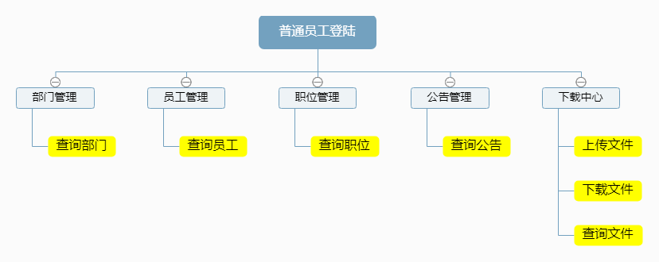

# 人事管理系统

#### 介绍
这是2023年上半学期的软工导论的大作业，为满足要求： 系统原型代码（前端+后端或前端）传到git上（尽量使用码云gitee，速度会快很多），在作业里附git项目地址。

#### 软件架构
软件架构说明

## 部署说明：

### 项目启动后，在浏览器中访问地址：http://127.0.0.1:8080/personnel/

#### 安装教程

1.  注意要把我之前的所有路径配置成你自己的
2.  注意tomcat的版本
3.  注意要把mysql-connector-j-8.0.33换成你自己匹配的版本

#### 使用说明

基础环境：JDK20，Tomcat9.0.83，MySQL8.0.35

## 加入了普通用户的功能，在登陆时可以选择，可以查询职位，部门，公告，文档，但不能对其他的进行修改。

## 使用JavaEE开发，基于SpringMVC+Mybatis框架，该项目包含了用户管理、部门管理、职位管理、员工管理、公告管理、下载中心等多个模块,页面使用JQuery框架完成动态功能,用户管理、部门管理等模块包含了项目开发中常用的增删改查动作,下载中心包含了 Spring MVC的文件上传、下载等功能

## 系统功能介绍

用户管理的功能包括：添加用户，用户可以为管理员或者普通用户;查询用户，可以查询所有用户或根据用户名和用户状态进行模糊查询，删除用户，修改用户。
部门管理的功能包括：添加部门，查询部门，可以查询所有部门或根据部门名称进行模糊查询，删除部门，修改部门
职位管理的功能包括：添加职位，查询职位，可以查询所有职位或根据职位名称进行模糊查询，删除职位，修改职位
员工管理的功能包括：添加员工，查询员工，可以查询所有员工或根据员工姓名，身份证号，手机号，性别，职位，部门进行模查询，删除员工，修改员工。
公告管理的功能包括：添加公告，查询公告，可以查询所有公告或根据公告名称，公告内容进行模糊查询，删除公告，修改公告。
下载中心的功能包括：上传文件，查淘文件，可以查询所有文件或根据文件标题进行模糊查询，预览文件内容：删除文件，下载文件。

